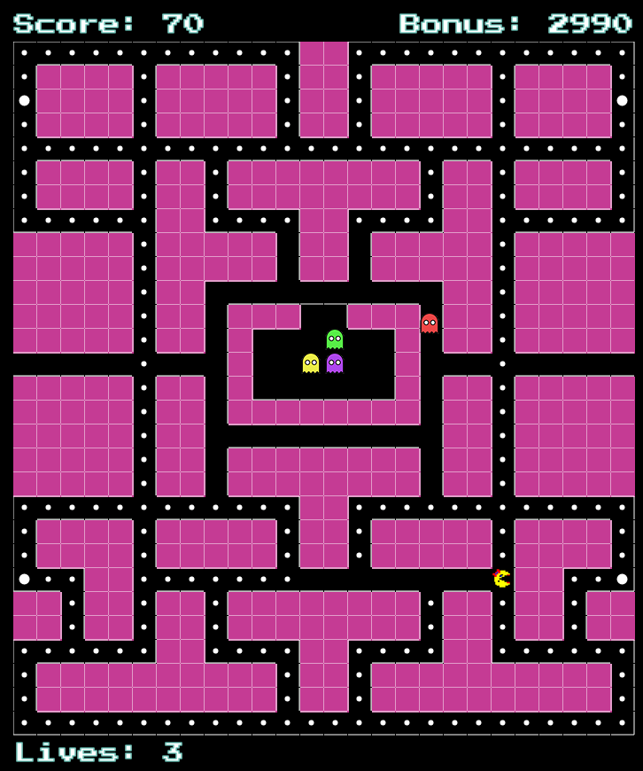

## Overview

Mrs. Snaccman is a multiplayer twist on the popular retro arcade game Pacman. Many of us have played this timeless classic. In the original, the player controls pacman as he avoids ghosts and attempts to collect as many pellets as he can before dying. 

In Mrs. Snaccman, we added multiplayer functionalities to make the game more engaging and fun to play with friends. We followed the classic, retro style of Pacman and made it better with modern day technologies of HTML Canvas, React.js and web sockets. The controls use the simple arrow keys on the keyboard to move Snaccman and the ghosts around the grid.

### Functionality and MVP Features

#### Functionality
* Players will use the arrow keys to control their sprites
* Snaccman
    * Goal is to collect all the pellets on the screen
    * Game ends when the player runs out of lives or collects all possible pellets
* Ghosts
    * Goal is to work together to kill Snaccman as many times as possible
    * Unless Snaccman is powered up, touching Snaccman will kill her
    
### Wireframe
INSERT PICTURE OF WELCOME SCREEN HERE

The app will initially consist of a single page that will contain a create and join lobby. 

INSERT PICTURE OF LOBBY HERE

Upon creating or joining a lobby, the user will be automatically assigned as a ghost and can move over as Snaccman unless there is already someone who claimed it. A start button will be at the bottom that the creator of the room can click to start the game.

The grid will be rendered and the game will be started after a short countdown. Game will be played until either snaccman clears the level or loses all her lives.

### Architecture and Technologies

#### Technologies 
* MERN stack
    * MangoDB/Express/Redux/Node.js
    * used to connect the front-end and back-end functionalities
* Canvas
    * Renders our game in our react component
    * Simplest and easiest to learn tool to render a game
* Socket.io
    * Handles multiplayer input
    * essential for multiplayer
* Webpack
    * bundles multiple scripts into one accessible source
    * makes life a lot easier

#### Architecture
In addition to the webpack entry file, we will have four main folders/files:

Classes: This folder holds all the classes for the various game objects and the grid for the game.

Game.js: Handles all the game logic and rendering
